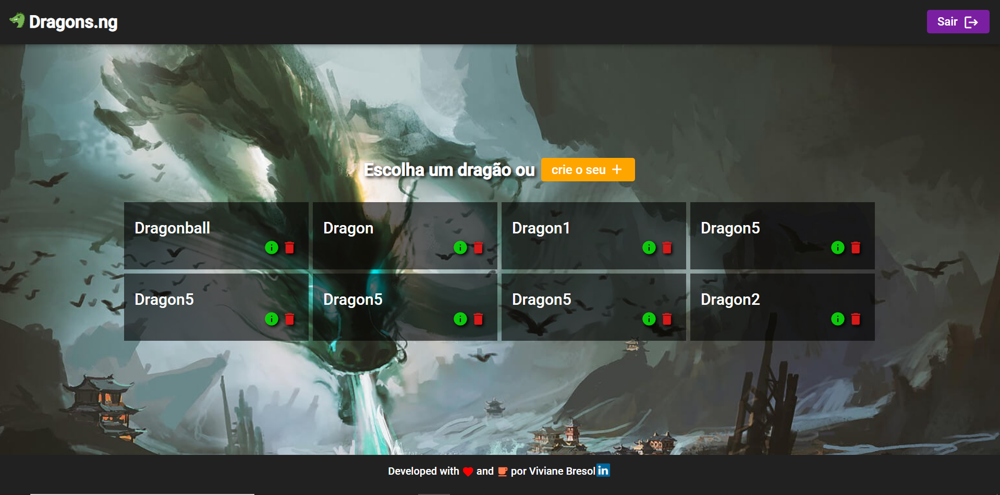
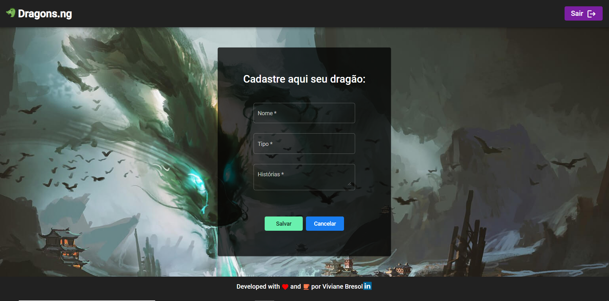
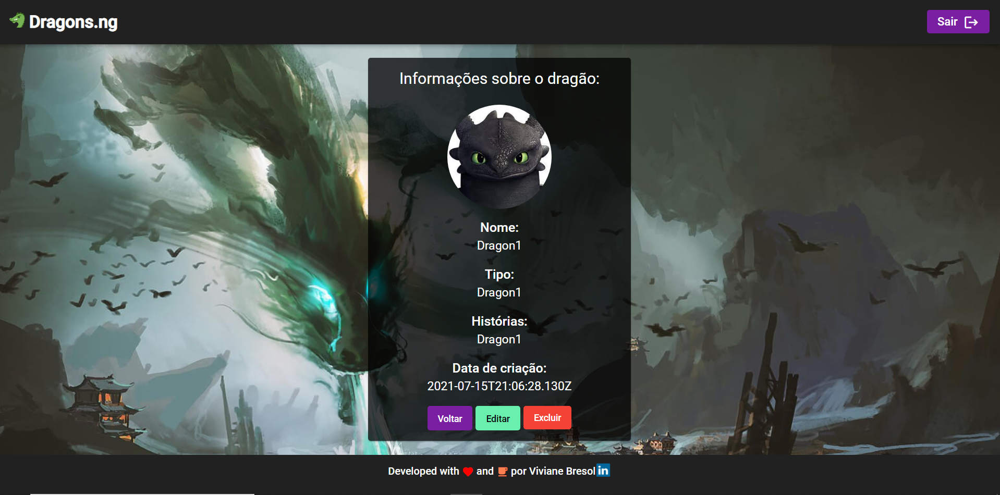
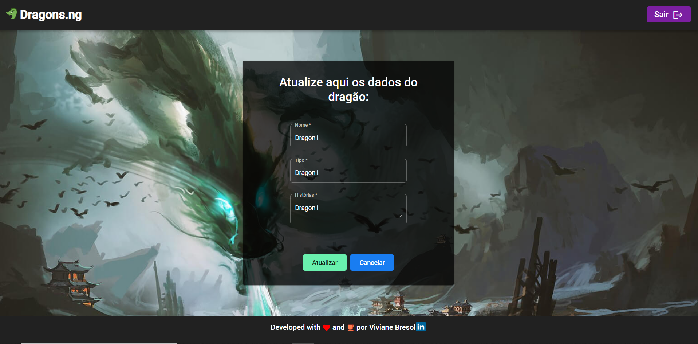

# Desafio de Frontend em Angular - Dragons

 

  
  

 

Esta é uma aplicação frontend, com consumo de uma API, desenvolvida com base nas orientações constantes neste link: [Teste para Desenvolvedor(a) Web](https://github.com/WoopSicredi/jobs/issues/6/).

 

## :hammer_and_wrench: Funcionalidades:

- Página principal com listagem dos dragões;
- Visualização de todas as informações de um dragão específico escolhido pelo usuário;
- Cadastro de um novo dragão;
- Possibilidade de editar um dragão;
- Possibilidade de excluir um dragão.

 

## :man_technologist: Imagens da Aplicação

### Homepage

 

### Cadastro de um dragão

 

### Informações do dragão

 

### Atualização de um dragão

 

 

## :nerd_face: Como rodar esse projeto no seu computador:

Após efetuar o download ou o clone do projeto, e estando dentro da pasta raiz, realizar os seguintes comandos no terminal:

### `npm install`

 Esse comando irá instalar todas as dependências necessárias para o projeto funcionar. 

### `npm start`

 Esse comando irá executar a aplicação em modo de desenvolvimento. 

Abra http://localhost:4200 para ver a aplicação no seu browser.

  

  
  

Made with 🧡 and :coffee: | Find me on <a href="https://www.linkedin.com/in/vivianebresolin/"> LinkedIn</a>

